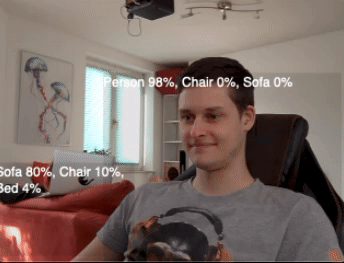

# YOLOCam

Real time object classification of a mac os camera device video input stream with the YOLOv3 ML model and a CoreMediaIO DAL virtual camera. 

Based on [seanchas116/SimpleDALPlugin](https://github.com/seanchas116/SimpleDALPlugin) and [johnboiles/coremediaio-dal-minimal-example](https://github.com/johnboiles/coremediaio-dal-minimal-example). 

Note to myself: Thank god I am only 0 to 1 percent like a chair 🪑

This project uses the preconverted YOLOv3-Tiny full precision core ml model from [https://developer.apple.com/machine-learning/models/](https://developer.apple.com/machine-learning/models/).

## How to run

* Build YOLOCam in Xcode
* Copy YOLOCam.plugin into `/Library/CoreMediaIO/Plug-Ins/DAL`
* Open Webcam-using app and choose YOLOCam as camera input

## What else?

* [Cameo](https://github.com/lvsti/Cameo) is good for debugging!
